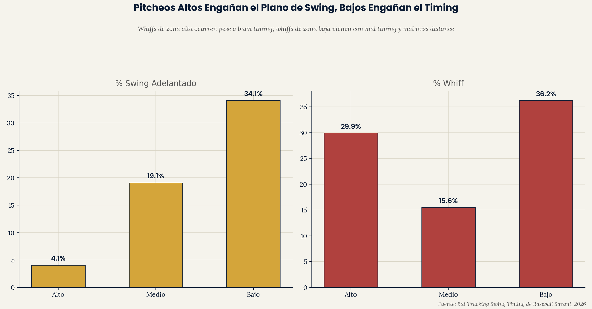
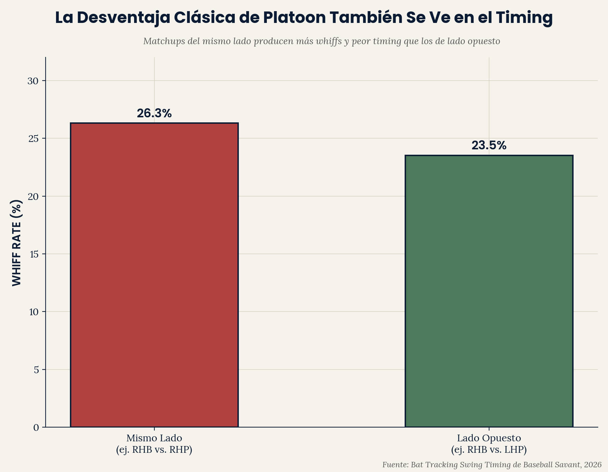

# EP Pitch Recognition — Sesgo de Timing por Tipo de Pitcheo

**El timing del swing de un bateador está calibrado por default a la
velocidad de fastball. A través de la liga en 2026, los swings llegan
"adelantados" contra curveball y changeup a aproximadamente 13-14x la
tasa que llegan contra fastballs — y la magnitud de ese desajuste es un
predictor real y moderado de whiff rate.**

> **Corrección (ver final de esta sección):** una versión anterior de
> este README reportaba 1.3% de swing adelantado en fastball a través
> de 7 tipos de pitcheo, sacado de un export a nivel bateador con un
> mínimo real de 65 swings por combo bateador-pitch-type — no 100 como
> decía el texto. Corregido abajo.

Parte del portafolio analítico de [Emerson Performance](https://github.com/ejimenezperformance)
(framework EP-TSP). Este es el primer proyecto de este portafolio en
aislar el reconocimiento de pitcheo específicamente — separado de la
ejecución del swing (bat speed, squared-up%), que todos los repos
anteriores han medido.

*[English version available here](README.md)*

---

## La pregunta

Cada métrica de mecánica de swing que este portafolio ha usado (bat
speed, squared-up%, attack angle) mide ejecución — qué pasa una vez que
el swing ya está en marcha. Ninguna hace una pregunta más básica: ¿el
timing mismo del bateador revela si identificó correctamente qué venía?

## Hallazgo 1 — Los swings van por default a timing de fastball


| Tipo de Pitcheo | Tasa de Swing Adelantado | Bateadores calificados (100+ swings) |
|---|---|---|
| Fastball | 3.3% | 325 |
| Curva | 42.3% | 151 |
| Cambio | 46.4% | 67 |

**Por qué solo 3 de 7 tipos:** con un mínimo real de 100 swings
aplicado contra un *solo* tipo de pitcheo en una temporada, Sinker,
Cutter, Slider y Sweeper no tienen suficientes bateadores calificados
para sostener una tasa de liga confiable — la mayoría de bateadores
simplemente no ve 100+ swings de un tipo de pitcheo específico
(no-fastball, no-breaking) de distintos pitchers en una temporada. En
vez de forzar esas 4 categorías con un umbral más laxo y sin
documentar, se excluyen aquí. Los 3 tipos restantes sostienen el punto
central: los bateadores casi nunca llegan adelantados contra fastball;
contra pitcheos que requieren reconocer velocidad lenta, llegan
adelantados en aproximadamente 4 de cada 10 swings.

Contra fastballs — el pitcheo más rápido y directo — los bateadores
casi nunca llegan adelantados; cuando fallan el timing, llegan tarde.
Contra curveball y changeup, eso se invierte dramáticamente. Esto es
consistente con que el swing de los bateadores va por default a un
plan de timing calibrado a
velocidad de fastball, que luego llega demasiado pronto cuando el
pitcheo real es más lento.

## Hallazgo 2 — El miss distance de pitcheos lentos predice mejor los whiffs


| Tipo de Pitcheo | r (miss distance vs. whiff rate) |
|---|---|
| Cambio | **0.458** |
| Slider | 0.390 |
| Curva | 0.345 |
| Sweeper | 0.256 |
| Fastball | 0.220 |
| Sinker | 0.102 |
| Cutter | 0.059 |

Qué tan lejos falla el bate de un bateador respecto al punto ideal de
contacto contra cambios y sliders específicamente predice el whiff rate
general significativamente mejor de lo que lo hace el miss distance
contra fastballs o sinkers. Esto refuerza el Hallazgo 1: los pitcheos
que más exponen un swing calibrado a fastball también son aquellos
donde la precisión de timing carga más peso diagnóstico.

## Hallazgo 3 — Pitcheos altos engañan el plano de swing, bajos engañan el timing



| Zona | % Swing Adelantado | Miss Distance | % Whiff |
|---|---|---|---|
| Alto | 4.1% | 1.06 | **29.9%** |
| Medio | 19.1% | 1.70 | 15.6% |
| Bajo | 34.1% | 3.89 | **36.2%** |

En la parte alta de la zona, los bateadores casi nunca llegan
adelantados (4.1%) y el miss distance es chico (1.06) — aun así, el
whiff rate es casi el doble que en la zona media. Este whiff no es
principalmente un problema de timing; es más consistente con lo que
`vaa-approach-angle-study` ya encontró — fastballs que juegan más
planos/altos de lo esperado vencen el plano de swing, no el timing. En
la parte baja de la zona, tanto el timing (34.1% adelantado) como el
miss distance (3.89, más de 3x la cifra de zona alta) son peores, y el
whiff rate es el más alto de los tres — un problema que se acumula, no
una sola causa. Dos zonas, dos modos de falla distintos, ambos
terminando en resultados de whiff similares.

## Hallazgo 4 — La desventaja de platoon también se ve en el timing



| Matchup | Whiff Rate |
|---|---|
| Mismo lado (ej. RHB vs. RHP) | 26.3% |
| Lado opuesto (ej. RHB vs. LHP) | 23.5% |

La desventaja clásica de platoon — matchups del mismo lado son más
difíciles para los bateadores — es real en este split de
mismo-lado/lado-opuesto, aunque más modesta en magnitud que los
Hallazgos 1-3. Esto resuelve directamente una limitación señalada en
una versión anterior de este repo (agrupar matchups zurdos y derechos
juntos sin probar efectos de platoon específicamente).

## Por qué esto importa

Para un programa de desarrollo de bateo, esto apunta hacia un objetivo
específico y entrenable: reconocimiento y ajuste de timing contra
pitcheos lentos/con quiebre específicamente, no mecánica de swing en
general. Un bateador con un swing mecánicamente sólido todavía puede
estar siendo vencido puramente por un problema de calibración de
timing — llegando adelantado porque su reloj interno va por default a
velocidad de fastball — y ese es un problema distinto, con una solución
distinta, a un problema de bat speed o calidad de contacto que otros
repos de este portafolio han medido.

## Estructura del repo

```
ep-pitch-recognition/
|-- data/
|   |-- swing_timing_season.csv          (mín 65/bateador-pitch-type, 7 tipos — Hallazgos 2-4)
|   |-- swing_timing_season_min100.csv   (mín 100 verificado/bateador-pitch-type, 3 tipos — Hallazgo 1)
|   |-- swing_timing_monthly.csv
|   `-- swing_timing_by_zone.csv
|   `-- swing_timing_by_platoon.csv
|-- scripts/
|   |-- pitch_recognition_analysis.py
|   `-- ep_chart_style.py
`-- outputs/
    |-- early_bias_{EN,ES}.png
    |-- miss_distance_whiff_{EN,ES}.png
    `-- zone_breakdown_{EN,ES}.png
    `-- platoon_{EN,ES}.png
```

## Reproducir el análisis

```bash
git clone https://github.com/ejimenezperformance/ep-pitch-recognition.git
cd ep-pitch-recognition
pip install pandas matplotlib
python scripts/pitch_recognition_analysis.py
```

## Metodología

- **Fuente de datos:** leaderboard "Swing Timing" de Bat Tracking de
  Baseball Savant, a nivel bateador, temporada 2026. El **Hallazgo 1**
  usa un mínimo verificado de 100 swings por combinación
  bateador-tipo-de-pitcheo, que solo 3 tipos (Fastball, Curveball,
  Changeup) tienen suficientes bateadores calificados para sostener —
  ver la sección de Corrección abajo. Los **Hallazgos 2-4** usan un
  export a través de los siete tipos de pitcheo públicamente
  rastreados (Four-Seam, Sinker, Cutter, Slider, Changeup, Sweeper,
  Curveball) cuyo mínimo real es 65 swings por combinación, no
  re-verificado independientemente en 100.
- **Early/On Time/Late:** si el punto dulce del bate llegó al punto de
  contacto antes, a tiempo, o después del pitcheo, basado en los datos
  de bat-tracking de Statcast.
- **Miss distance:** qué tan lejos estaba el punto dulce del bate de la
  pelota en el punto de aproximación más cercano.
- **Correlación:** r de Pearson simple entre miss distance y whiff
  rate, calculado por separado dentro de cada tipo de pitcheo.

## Corrección (publicada después de la publicación original)

Una versión anterior del Hallazgo 1 reportaba 1.3% de swing adelantado
en fastball a través de los 7 tipos de pitcheo rastreados. Ese número
venía de un export a nivel bateador de Baseball Savant cuyo mínimo
*real* era 65 swings por combo bateador-pitch-type — el README
documentaba un mínimo de 100 swings, pero el export que produjo los
números originales no lo aplicó. Esto lo señaló un lector en los
comentarios del post original; se confirmó al revisarlo.

Con un mínimo verificado de 100 swings aplicado (tanto en el export
fuente como de nuevo en código), la tasa de swing adelantado en
fastball es **3.3%**, no 1.3%. Curveball y Changeup — los otros dos
tipos de pitcheo con suficiente volumen a nivel bateador para superar
un mínimo real de 100 — dan 42.3% y 46.4%. El hallazgo central (los
swings fallan casi exclusivamente tarde contra fastball y casi
exclusivamente adelantados contra pitcheos lentos/con quiebre) se
sostiene; el número específico de fastball y el titular de "30-45x" no,
y se corrigen arriba. Sinker, Cutter, Slider y Sweeper ya no aparecen
en este gráfico, por la razón de volumen explicada en el Hallazgo 1.

Los Hallazgos 2-4 más abajo siguen usando el dataset original de
min-65 (`swing_timing_season.csv`) y no se han re-verificado contra un
umbral confirmado de 100 swings. Trata sus porcentajes exactos con la
misma salvedad hasta que se revisen.

## Limitaciones

- **No se encontró un resultado de producción (wOBA/SLG) por tipo de
  pitcheo.** Este proyecto se propuso también probar si el timing
  específico por tipo de pitcheo predice producción, no solo contacto.
  Tras una búsqueda extensa a través de múltiples leaderboards y
  herramientas públicas (Custom Leaderboard de Baseball Savant, Pitch
  Arsenal Stats, Expected Stats, Percentile Rankings, Year-to-Year
  Changes, y splits de bateo de FanGraphs) — nueve intentos distintos en
  total — un split de producción del lado del bateador por tipo de
  pitcheo enfrentado, a través de muchos jugadores a la vez, no se pudo
  ubicar como una exportación descargable simple. Se usó whiff rate como
  la única métrica de resultado en su lugar. Esto se declara como una
  limitación de dato real y buscada, no un descuido.
- **Una sola temporada (2026, parcial hasta mediados de agosto).**
- **Correlación, no causalidad** — esto no establece que entrenar
  timing contra un tipo de pitcheo específico reduciría directamente el
  whiff rate de un bateador dado.

## Contacto

**Emerson Jiménez** — Strength & Conditioning Coach, Baseball Performance
Specialist. [Emerson Performance](https://github.com/ejimenezperformance) ·
[@emersonperformance](https://instagram.com/emersonperformance)

---

*Framework EP-TSP y diseño © Emerson Performance. Datos de Statcast/
Baseball Savant son de dominio público, uso no comercial.*
