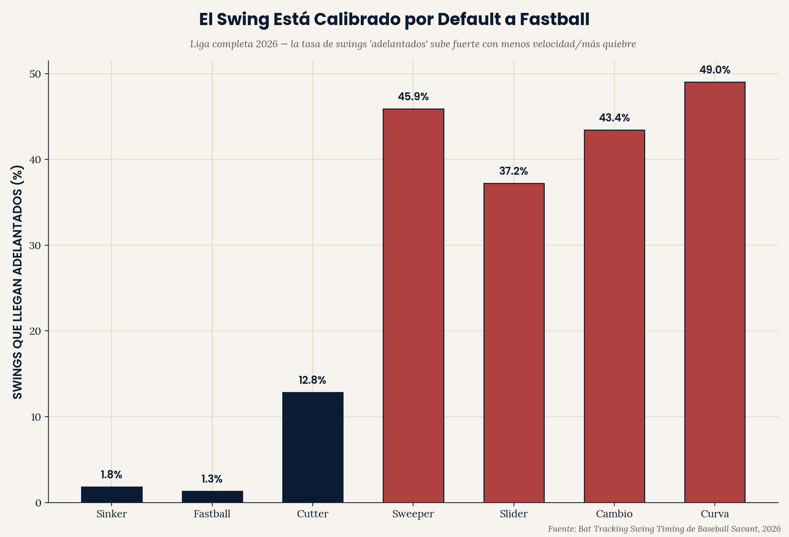
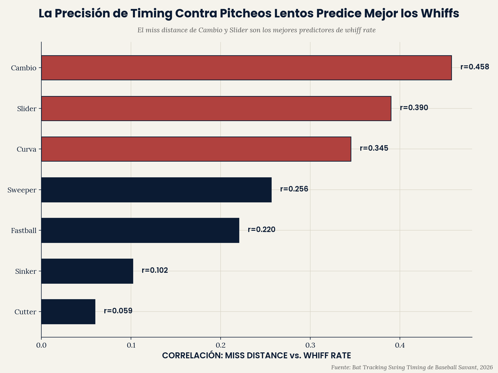

# EP Pitch Recognition — Sesgo de Timing por Tipo de Pitcheo

**El timing del swing de un bateador está calibrado por default a la
velocidad de fastball. A través de la liga en 2026, los swings llegan
"adelantados" contra pitcheos lentos/con quiebre a 30-45x la tasa que
llegan contra fastballs — y la magnitud de ese desajuste es un
predictor real y moderado de whiff rate.**

Parte del portafolio analítico de [Emerson Performance](https://github.com/ejimenezperformance)
(framework EP-TSP). Este es el primer proyecto de este portafolio en
aislar el reconocimiento de pitcheo específicamente — separado de la
ejecución del swing (bat speed, squared-up%), que todos los repos
anteriores han medido.

*[English version available here](README.md)*

---

## La pregunta

Cada métrica de mecánica de swing que este portafolio ha usado (bat
speed, squared-up%, attack angle) mide ejecución — qué pasa una vez que
el swing ya está en marcha. Ninguna hace una pregunta más básica: ¿el
timing mismo del bateador revela si identificó correctamente qué venía?

## Hallazgo 1 — Los swings van por default a timing de fastball



| Tipo de Pitcheo | Tasa de Swing Adelantado |
|---|---|
| Fastball | 1.3% |
| Sinker | 1.8% |
| Cutter | 12.8% |
| Slider | 37.2% |
| Cambio | 43.4% |
| Sweeper | 45.9% |
| Curva | 49.0% |

Contra fastballs y sinkers — los pitcheos más rápidos y directos — los
bateadores casi nunca llegan adelantados; cuando fallan el timing,
llegan tarde. Contra cada tipo de pitcheo más lento y engañoso, eso se
invierte dramáticamente: los bateadores llegan adelantados en
aproximadamente 4 de cada 10 swings. Esto es consistente con que el
swing de los bateadores va por default a un plan de timing calibrado a
velocidad de fastball, que luego llega demasiado pronto cuando el
pitcheo real es más lento.

## Hallazgo 2 — El miss distance de pitcheos lentos predice mejor los whiffs



| Tipo de Pitcheo | r (miss distance vs. whiff rate) |
|---|---|
| Cambio | **0.458** |
| Slider | 0.390 |
| Curva | 0.345 |
| Sweeper | 0.256 |
| Fastball | 0.220 |
| Sinker | 0.102 |
| Cutter | 0.059 |

Qué tan lejos falla el bate de un bateador respecto al punto ideal de
contacto contra cambios y sliders específicamente predice el whiff rate
general significativamente mejor de lo que lo hace el miss distance
contra fastballs o sinkers. Esto refuerza el Hallazgo 1: los pitcheos
que más exponen un swing calibrado a fastball también son aquellos
donde la precisión de timing carga más peso diagnóstico.

## Por qué esto importa

Para un programa de desarrollo de bateo, esto apunta hacia un objetivo
específico y entrenable: reconocimiento y ajuste de timing contra
pitcheos lentos/con quiebre específicamente, no mecánica de swing en
general. Un bateador con un swing mecánicamente sólido todavía puede
estar siendo vencido puramente por un problema de calibración de
timing — llegando adelantado porque su reloj interno va por default a
velocidad de fastball — y ese es un problema distinto, con una solución
distinta, a un problema de bat speed o calidad de contacto que otros
repos de este portafolio han medido.

## Estructura del repo

```
ep-pitch-recognition/
|-- data/
|   |-- swing_timing_season.csv
|   `-- swing_timing_monthly.csv
|-- scripts/
|   |-- pitch_recognition_analysis.py
|   `-- ep_chart_style.py
`-- outputs/
    |-- early_bias_{EN,ES}.png
    `-- miss_distance_whiff_{EN,ES}.png
```

## Reproducir el análisis

```bash
git clone https://github.com/ejimenezperformance/ep-pitch-recognition.git
cd ep-pitch-recognition
pip install pandas matplotlib
python scripts/pitch_recognition_analysis.py
```

## Metodología

- **Fuente de datos:** leaderboard "Swing Timing" de Bat Tracking de
  Baseball Savant, temporada 2026, los siete tipos de pitcheo
  públicamente rastreados (Four-Seam, Sinker, Cutter, Slider, Changeup,
  Sweeper, Curveball). Mínimo 100 swings por combinación
  jugador-tipo-de-pitcheo (integrado en la exportación de la fuente).
- **Early/On Time/Late:** si el punto dulce del bate llegó al punto de
  contacto antes, a tiempo, o después del pitcheo, basado en los datos
  de bat-tracking de Statcast.
- **Miss distance:** qué tan lejos estaba el punto dulce del bate de la
  pelota en el punto de aproximación más cercano.
- **Correlación:** r de Pearson simple entre miss distance y whiff
  rate, calculado por separado dentro de cada tipo de pitcheo.

## Limitaciones

- **No se encontró un resultado de producción (wOBA/SLG) por tipo de
  pitcheo.** Este proyecto se propuso también probar si el timing
  específico por tipo de pitcheo predice producción, no solo contacto.
  Tras una búsqueda extensa a través de múltiples leaderboards y
  herramientas públicas (Custom Leaderboard de Baseball Savant, Pitch
  Arsenal Stats, Expected Stats, Percentile Rankings, Year-to-Year
  Changes, y splits de bateo de FanGraphs) — nueve intentos distintos en
  total — un split de producción del lado del bateador por tipo de
  pitcheo enfrentado, a través de muchos jugadores a la vez, no se pudo
  ubicar como una exportación descargable simple. Se usó whiff rate como
  la única métrica de resultado en su lugar. Esto se declara como una
  limitación de dato real y buscada, no un descuido.
- **Una sola temporada (2026, parcial hasta mediados de agosto).**
- **Correlación, no causalidad** — esto no establece que entrenar
  timing contra un tipo de pitcheo específico reduciría directamente el
  whiff rate de un bateador dado.
- **Agrupa bateadores zurdos y derechos juntos** — efectos de platoon
  (ej. pitcheos de quiebre del mismo lado vs. lado opuesto) no se
  separan aquí.

## Contacto

**Emerson Jiménez** — Strength & Conditioning Coach, Baseball Performance
Specialist. [Emerson Performance](https://github.com/ejimenezperformance) ·
[@emersonperformance](https://instagram.com/emersonperformance)

---

*Framework EP-TSP y diseño © Emerson Performance. Datos de Statcast/
Baseball Savant son de dominio público, uso no comercial.*
