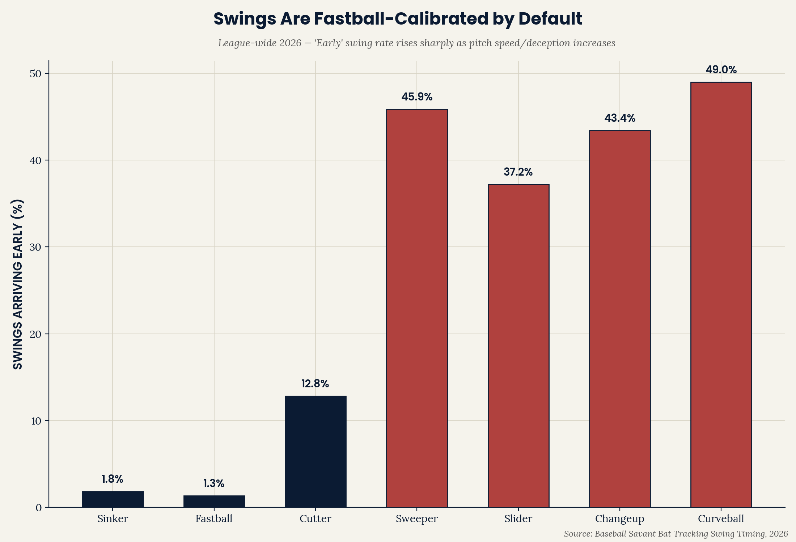
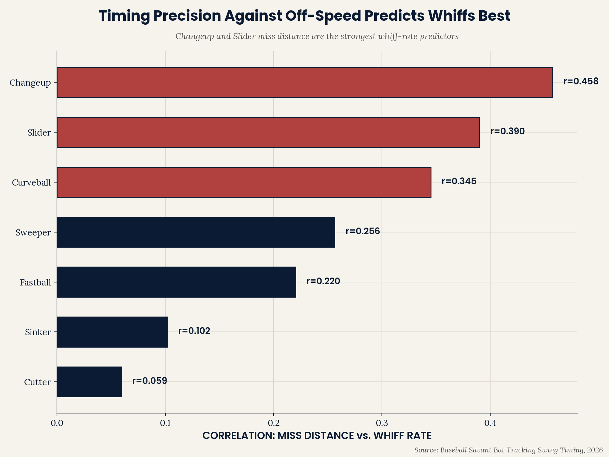

# EP Pitch Recognition — Timing Bias by Pitch Type

**A hitter's swing timing is calibrated for fastball velocity by
default. Across the league in 2026, swings arrive "early" against
off-speed and breaking pitches at 30-45x the rate they do against
fastballs — and the magnitude of that mistiming is a real, moderate
predictor of whiff rate.**

Part of the [Emerson Performance](https://github.com/ejimenezperformance)
analytics portfolio (EP-TSP framework). This is the first project in
this portfolio to isolate pitch recognition specifically — separate
from swing execution (bat speed, squared-up%), which every prior repo
has measured.

*[Versión en español disponible aquí](README.es.md)*

---

## The question

Every swing mechanics metric this portfolio has used (bat speed,
squared-up%, attack angle) measures execution — what happens once the
swing is already underway. None of them ask a more basic question:
does the hitter's timing itself reveal whether he correctly identified
what was coming?

## Finding 1 — Swings default to fastball timing



| Pitch Type | Early Swing Rate |
|---|---|
| Fastball | 1.3% |
| Sinker | 1.8% |
| Cutter | 12.8% |
| Slider | 37.2% |
| Changeup | 43.4% |
| Sweeper | 45.9% |
| Curveball | 49.0% |

Against fastballs and sinkers — the fastest, straightest pitches —
hitters are almost never early; when they miss timing, they're late.
Against every slower, more deceptive pitch type, that flips
dramatically: hitters arrive early on roughly 4 in 10 swings. This is
consistent with hitters' swings defaulting to a fastball-speed timing
plan, which then arrives too soon when the actual pitch is slower.

## Finding 2 — Off-speed miss distance predicts whiffs best



| Pitch Type | r (miss distance vs. whiff rate) |
|---|---|
| Changeup | **0.458** |
| Slider | 0.390 |
| Curveball | 0.345 |
| Sweeper | 0.256 |
| Fastball | 0.220 |
| Sinker | 0.102 |
| Cutter | 0.059 |

How far a hitter's bat misses the ideal contact point against
changeups and sliders specifically predicts overall whiff rate
meaningfully better than miss distance against fastballs or sinkers
does. This reinforces Finding 1: the pitches that most expose a
fastball-calibrated swing are also the ones where timing precision
carries the most diagnostic weight.

## Why this matters

For a hitting development program, this points toward a specific,
trainable target: recognition and timing adjustment against
off-speed/breaking pitches specifically, not swing mechanics broadly.
A hitter with a mechanically sound swing can still be getting beaten
purely by a timing calibration issue — arriving early because his
internal clock defaults to fastball speed — and that's a different
problem, with a different fix, than a bat-speed or contact-quality
issue this portfolio's other repos have measured.

## Repo structure

```
ep-pitch-recognition/
|-- data/
|   |-- swing_timing_season.csv
|   `-- swing_timing_monthly.csv
|-- scripts/
|   |-- pitch_recognition_analysis.py
|   `-- ep_chart_style.py
`-- outputs/
    |-- early_bias_{EN,ES}.png
    `-- miss_distance_whiff_{EN,ES}.png
```

## Reproduce the analysis

```bash
git clone https://github.com/ejimenezperformance/ep-pitch-recognition.git
cd ep-pitch-recognition
pip install pandas matplotlib
python scripts/pitch_recognition_analysis.py
```

## Methodology

- **Data source:** Baseball Savant Bat Tracking "Swing Timing" leaderboard,
  2026 season, all seven publicly tracked pitch types (Four-Seam, Sinker,
  Cutter, Slider, Changeup, Sweeper, Curveball). Minimum 100 swings per
  player-pitch-type combination (built into the source export).
- **Early/On Time/Late:** whether the bat's sweet spot arrived at the
  contact point before, at, or after the pitch, based on Statcast's
  bat-tracking data.
- **Miss distance:** how far the bat's sweet spot was from the ball at
  the point of closest approach.
- **Correlation:** simple Pearson r between miss distance and whiff
  rate, computed separately within each pitch type.

## Limitations

- **No production outcome (wOBA/SLG) by pitch type was found.** This
  project set out to also test whether pitch-type-specific timing
  predicts production, not just contact. After an extensive search
  across multiple public leaderboards and tools (Baseball Savant's
  Custom Leaderboard, Pitch Arsenal Stats, Expected Stats, Percentile
  Rankings, Year-to-Year Changes, and FanGraphs' batting splits) — nine
  distinct attempts in total — a batter-side production split by pitch
  type faced, across many players at once, could not be located as a
  simple downloadable export. Whiff rate was used as the sole outcome
  metric instead. This is disclosed as a real, searched-for data
  limitation, not an oversight.
- **A single season (2026, partial through mid-August).**
- **Correlation, not causation** — this doesn't establish that
  training timing against a specific pitch type would directly reduce
  a given hitter's whiff rate.
- **Pools left-handed and right-handed hitters together** — platoon
  effects (e.g., same-handed vs. opposite-handed breaking balls) are
  not separated out here.

## Contact

**Emerson Jiménez** — Strength & Conditioning Coach, Baseball Performance
Specialist. [Emerson Performance](https://github.com/ejimenezperformance) ·
[@emersonperformance](https://instagram.com/emersonperformance)

---

*EP-TSP framework and design © Emerson Performance. Statcast/Baseball
Savant data is public domain, non-commercial use.*
